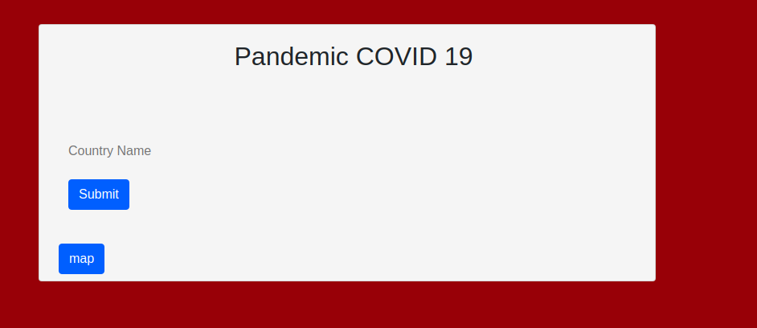
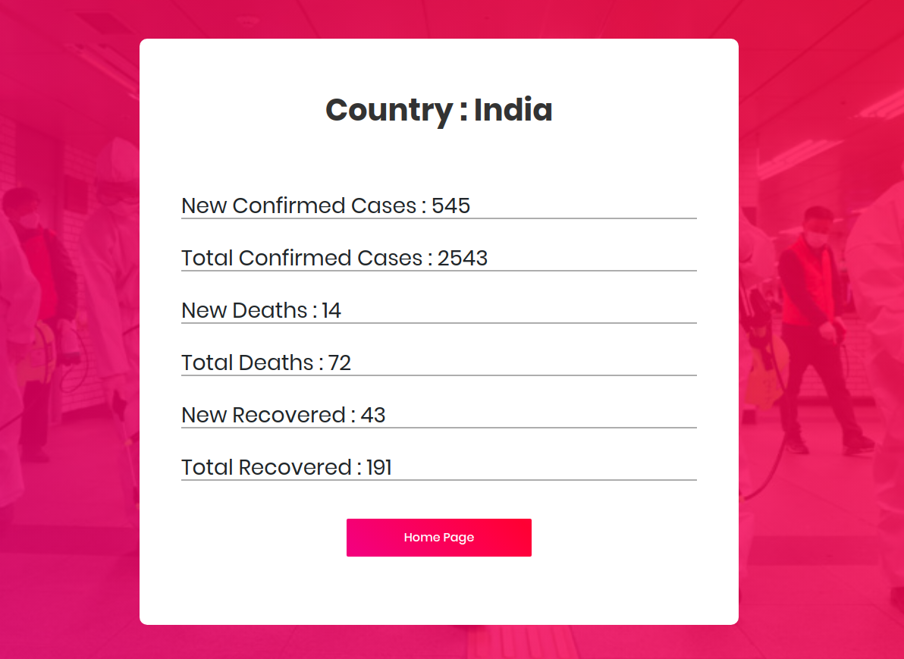
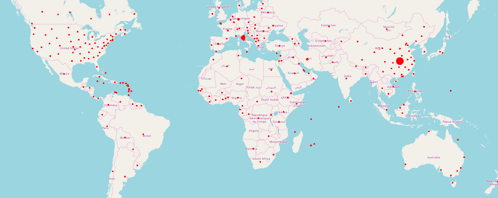

# OSSDEV_Pandemic_COVID_19

I deploy my project on heroku you will get this from given link <a href="https://harshcovid.herokuapp.com/">Click Here</a>

And you want to start on your local host than please refer the requirement.txt file for installing the dependencies
 

<h1>Main Page</h1>

<h4>Let's see the effect of corona in india</h4>

<h4>In all over the world</h4>

